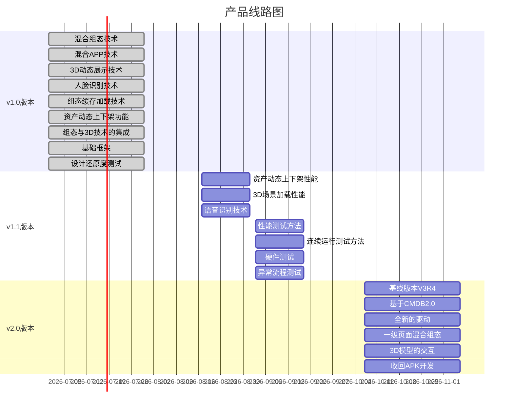

# 云机柜性能优化专项
此处为内容

----

## 项目背景
云机柜产品是基于共济发展目标和战略推出的核心产品之一，是未来分布式数据中心的产品形态雏形，是给边缘计算，企业搭建云服务等场景提供稳定，简单的数据中心整体解决方案。

----

云机柜1.0项目实现了云机柜产品的从0到1，决定了产品的基本形态；打通了开发的整个链条，形成了从市场到开发的良性沟通机制；实现了3D技术，人脸识别，混合APP等技术，锻炼了队伍，提升了队伍的信心。

----

目前，整个开发团队，士气空前高涨，对接下来的技术攻关充满信心，建议在短暂休整过后尽快开始语音控制，3D加载速度，资产条响应速度的技术攻关。高标准完成最后的产品包装和发布，提升开发团队的信心，扭转负面的认知。

----

## 市场的需求

客户已经开始介入
重要客户的演示持续进行
完整的解决方案即将发布

----

## 线路图

1.0版本——核心功能实现（已完成）
1.1版本——性能和稳定性（下阶段目标）
2.0版本——基础框架升级

----

# 阶段回顾

----

## 成绩

云机柜1.0项目的上线，离不开项目组的每个人的努力，在混合组态、混合应用、智能应用、三维展示、资产管理方面做出了非常多的突破。

----

----

## 混合组态技术

混合组态技术在竞争对手“中智”的解决方案中运用的非常深入，具有加载速度快、体验好、组态标准化、组态效率高等特点。其原理就是采用H5页面与组态相结合的形式，将组态的整体布局，导航逻辑使用H5页面经验固化下来。测点绑定流程使用后台配置的手段。

在云机柜项目1.0中，亦采用了混合组态技术，实现了导航逻辑和交互动画的提升，并计划将“标准混合组态”技术加入到下半年的开发计划中。

----

----

## 混合APP技术

混合APP技术即使用安卓原生应用提供系统底层能力，使用网页作为界面的载体，充分利用网页开发周期短，灵活，技术成熟的特点，结合混合组态页面，实现了系统底层api和界面的直接通讯，跳过了服务层。微信小程序就是这种技术的最佳应用案例，混合应用已为更多的头部企业所采用。

----

在1.0中，人脸识别、氛围灯控制都是跳过了后台服务，使用apk与js混合的模式，直接调用系统的底层api。

----

## 3D动态展示技术

3D与数据中心业务的深度结合，一直是数据中心界面发展的方向，也是未来虚拟现实，增强现实的基础。可以说3D技术如果实现，vr、ar只是硬件载体的问题。

----

1.0项目中3D技术迭代了5次，unity3D-html路线、threejs-3D模型路线、3D图元-threejs路线、threejs-iframe、threejs-bundle路线（计划中）。每次的迭代都将性能和加载速度提升50%左右。3D组态的性能消耗主要分为：网络传输、库文件解析、模型解析、GPU渲染四个部分。共济的3D图元采用了预解析技术、脚本生成模型的方式，解决了库文件与模型的解析问题；通过将bundle文件直接打包到apk中解决网络传输的问题（计划）；通过apk的设置开启GPU渲染（2D采用CPU渲染），在下个版本3D加载的性能会得到本质提升。

----

----

## 人脸识别技术

商汤的解决方案，采用商汤的摄像头硬件、用户id存储在硬件、由APK调用并为前端页面提供js 接口，实现人脸识别鉴权。

----

----

## 组态缓存加载技术

组态的历史包袱重，依赖的库极多，传输、解析时间都极长，1.0项目中将组态内的信息进行缓存，在页面切换时不销毁依赖的库和文件，只是销毁画布，重新绘制。极大的提升了组态页面加载的性能，但是在一些图元（例如机柜图元）上表现很差。

----

## 资产动态上下架功能

资产动态上下架，为用户创造了极简的操作体验，非常适合微模块的使用场景，目前功能已经跑通，但在CMDB的性能和驱动的性能上存在很大的优化空间。

----

----

## 组态与3D技术的集成

开源Threejs库，集成到现有的组态页面尝试了三种思路：通过iframe嵌入；与现有界面一起打包；通过组态图元嵌入画布。三种路径都已尝试，测试环境已经可以做到0.1s加载，即将部署到生产。

----

## 基础框架

配电、环境、防护、资产、IT设施五大子系统；宏观的总览模块；微观层面，PDU、UPS、空调、机柜详情、历史曲线、开门记录（抓拍）功能都已实现。

----

## 设计还原度测试

由交互设计组进行了还原度测试，组态页面还原度达到95%以上。

----

# 不足
目前暴露出性能和加载速度方面的不足，计划在9月30日前解决。
- 资产性能不足
- 3D加载时长
- 操作频繁时出现异常
- 智能语音尚未实现
- 测试方面需要为发布做准备

----

# 目标930
达到市场准入、发布的标准

----

## 核心需求范围

- 基于V3R4的监控平台
- 通用设计
- 资产上下架性能
- 3D加载性能
- 语音识别技术
- 系统性能与稳定性优化

----

## 基于V3R4的监控平台

所有一阶段的功能，将从V3R3的平台，迁移到最新的V3R4。以获得更好的稳定性，扩展性，以及可维护性。

----

## 通用设计

在没有接触过系统的用户，但有少量行业背景的人群中，进行交互的按钮进行交互测试

- 无论如何用户都会发现可以交互的按钮么？
- 用户在点击之前可以预计到将要发生什么反馈么？
- 无论如何用户都敢于点击交互么？
- 真实的反馈可以达到预期么？可以制造惊喜么？

----

## 资产上下架性能
用户操作资产到界面变化时间达到3~5s
- 从用户操作到MQ发布变化事件，时间不超过2s
- 从MQ收到事件到CMDB发生变化，时间不超过2s
- 从资产接口可以查到变化，到界面刷新不超过1.5s

----

## 3D场景加载性能

从点击到3D场景加载出来，时间不超过0.2s，动态数据加载不超过1.5s

----

# 语音识别技术

----

## 语音唤醒功能
基于单麦克风实现语音唤醒功能，唤醒词为“小智精灵”。
唤醒识别正确率不低于90%，误唤醒不高于48小时一次。

----

## 语音控制词识别功能
基于单麦克风实现对智能机柜的语音命令词识别，成功识别到命令词后，按照约定方式反馈识别结果到应用软件，命令词总计60条，优先实现以下四类共14条命令：

----

- 空调温度设置类命令——调高一点、调低一点
- 平板亮度设置类命令——调暗一点、调亮一点、最大亮度、最小亮度、中等亮度
- 开门设置类命令——  打开前门、打开后门、打开天窗
- 查询类命令——  告警查询、温度查询、配电数据
- 识别正确率不低于90%。
- 异常处理——如果传送给语音模块的语音文件经识别分析后未命中任何命令，则启用识别异常反馈。

----

# 测试

----

## 性能测试

- 连接10个资产条
- 反复操作资产上下架（驱动压力测试）
- 多用户同时访问资产组态（接口压力测试）

----

## 连续运行测试
- 正常条件下，连续运行1周以上，测量CPU、内存发生的变化（包含服务器和平板客户端）

----

## 异常流程测试
- 反复操作资产上下架
- EIC中写入不同U高进行上架操作

----

## 系统压力测试

- 满负荷环境搭建
- 同一个串口连接多个硬件的测试
- 彩虹CPU、内存、磁盘IO测试
- 驱动测试（硬件操作到MQ事件）

----

# 附录

----

## 项目资源

重点功能指定专门负责人，其余功能的资源按项目计划动态流入

- 资产模块性能优化—吴小盛
- 3D性能优化—杜耀
- 智能语音—谢洁敏
- 软件测试—吴纤
- 采集及驱动优化——陈俊杰

