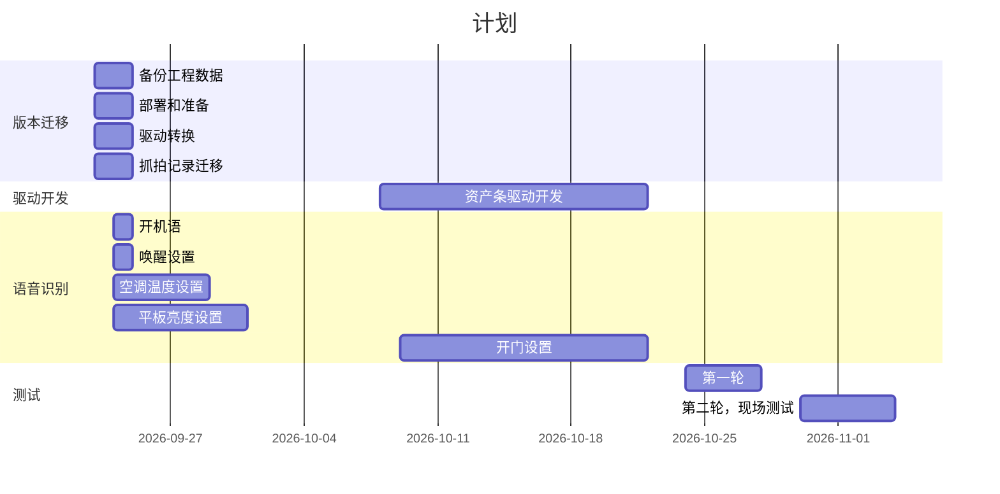

# 云机柜版本迁移
## 目录
1. 项目背景
2. 项目目标
3. V3R4版本迁移
4. 采集移植的验证
5. 新的驱动的开发
6. 语音识别模块
7. 长时间运行崩溃的问题
8. 项目计划

## 1. 项目背景

云机柜产品是基于共济发展目标和战略推出的核心产品之一，是未来分布式数据中心的产品形态雏形，是给边缘计算，企业搭建云服务等场景提供稳定，简单的数据中心整体解决方案。

云机柜1.0项目实现了云机柜产品的从0到1，决定了产品的基本形态；打通了开发的整个链条，形成了从市场到开发的良性沟通机制；实现了3D技术，人脸识别，混合APP等技术，锻炼了队伍，提升了队伍的信心。

## 2. 项目目标

- V3R4版本迁移
- 采集移植的验证
- 新的驱动的开发
- 语音识别模块
- 遗留的问题——长时间运行崩溃的问题

## 3. V3R4版本迁移

- 备份工程数据——吴纤
- 硬件的准备彩虹C——刘磊
- 在发布服务器3.78 配置 发布的tag，5.197构建环境，打整包 —— 刘彬
- 抓拍记录迁移——刘彬、文思秒
- 安装部署，数据还原——刘彬

## 4. 新的驱动的开发

- 标准驱动直接转换——周金伐
- 部署新的驱动，确定开发的驱动的数量，含自测——周金伐
- 新的开发计划，含自测（2S左右的时间到MQ）——陈俊杰

## 5. 语音识别模块
开机语
唤醒设置
空调温度设置
平板亮度设置
开门设置

## 6. 系统测试
- 第一轮
- 第二轮，现场测试

## 7. 长时间运行崩溃的问题

- 验证是否是页面的问题——已经打测试包
- 通过每半小时刷新

## 8. 项目计划

